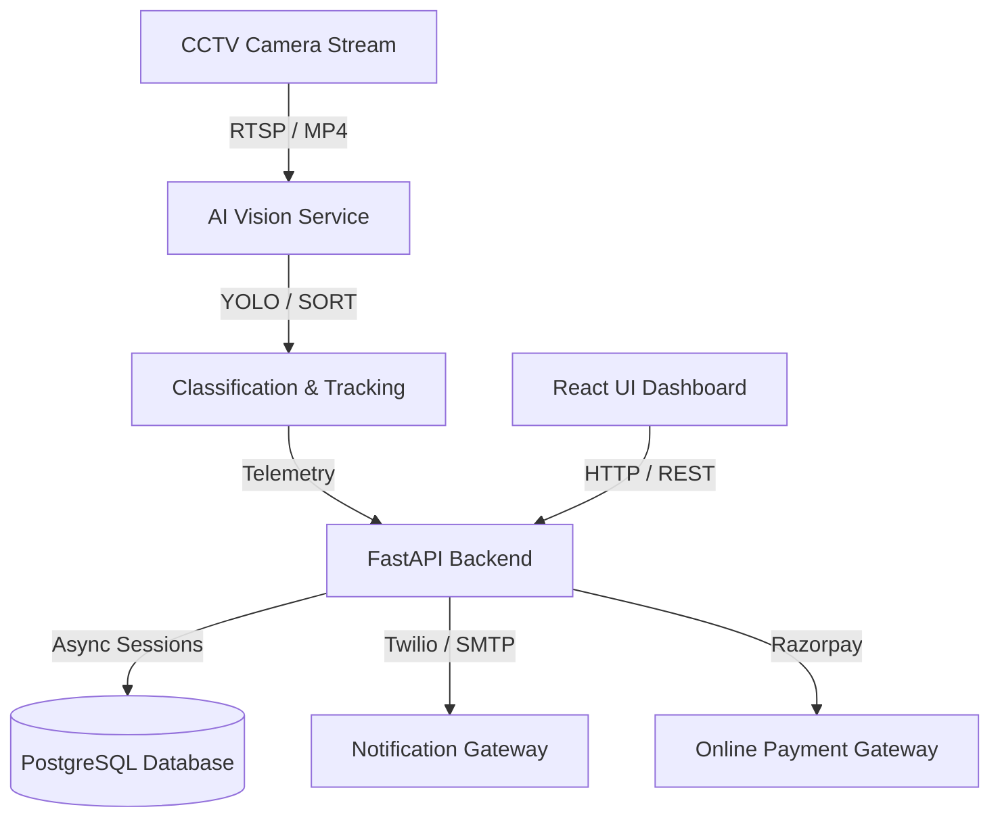

# Architecture & Data Flow

## System Design
The platform follows a microservices-inspired architecture designed to process high-throughput frames with minimal latency:

## Request-Response Flow
1. **Frame Capture**: `ai_service` grabs images from a camera stream.
2. **Analysis**: Detection algorithms classification engine checks frame segments.
3. **API Upload**: If an anomaly or violation is detected, `ai_service` calls `POST /api/violations` sending bounding metadata and cropped evidence plates.
4. **Database Insertion**: The API creates the records inside PostgreSQL database tables.
5. **Notification**: The system generates a PDF Challan and fires notification threads to mail/SMS providers.
6. **Payment**: The vehicle owner opens the payment portal, triggering Razorpay verification.
7. **Telemetry Log**: Real-time traffic stats flow into dashboard charts.
